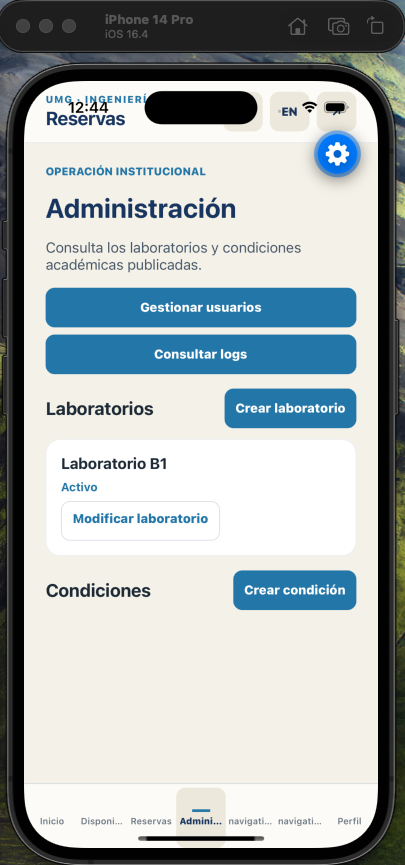
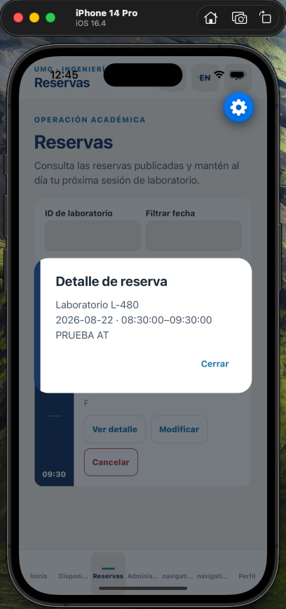
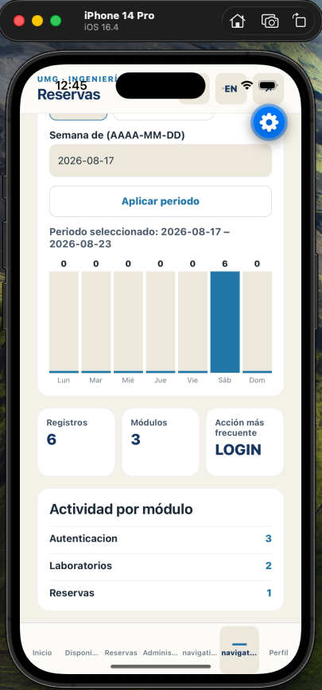

# Reservas UMG Mobile

Cliente móvil nativo para la reserva de laboratorios de UMG. Está construido
desde cero con React Native, Expo y Expo Router para Android e iOS; no envuelve
ni convierte `reservas-front`. Ese repositorio solo es la referencia funcional
y visual del producto.

La aplicación consume exclusivamente Render v1 en
[`/api/docs/`](https://umg-api-django.onrender.com/api/docs/) mediante el
contrato versionado del repositorio.

## Vistas de la aplicación

<p align="center">
  
  
  
</p>

| Administración | Reservas | Logs de auditoría |
| --- | --- | --- |
| Laboratorios, condiciones y rutas administrativas. | Consulta, detalle, creación, edición y cancelación. | Actividad semanal, métricas, filtros y paginación local. |

## Qué incluye

- Bienvenida, acceso institucional y sesión de interfaz persistida de forma
  segura con Expo SecureStore.
- Inicio con próximas reservas por rol, disponibilidad por fecha e intervalo,
  y flujo completo de reservas.
- Perfil y cambio de contraseña; administración de laboratorios, condiciones,
  usuarios y logs para el rol administrativo en la interfaz.
- Español por defecto, inglés seleccionable, tema claro/oscuro, navegación
  nativa, estados de carga/error/vacío/stale/offline y mutaciones bloqueadas
  sin conexión.
- Accesibilidad nativa: targets de al menos 44 pt, etiquetas y hints para
  controles de icono ambiguos, foco de diálogo y soporte de reduced motion.

## Límites de seguridad y API

- Render v1 es el único backend permitido. El cliente no usa endpoints v2,
  proxy, JWT/refresh, notificaciones, reportes ni datos simulados.
- [`src/api/renderApi.js`](src/api/renderApi.js) es la única frontera de red:
  usa los endpoints publicados para login, contraseña, usuarios, laboratorios,
  condiciones, disponibilidad, reservas y logs.
- Solo se conserva `{ id, name, email, role }` de la identidad de interfaz en
  SecureStore. Nunca se persisten contraseñas, tokens, cookies ni respuestas
  completas de API.
- La visibilidad por rol en móvil es una ayuda de experiencia; Render debe
  aplicar autorización y propiedad de objetos en el backend.

## Iniciar el proyecto localmente

### Requisitos

- Node.js **22.13.x** (`node --version`). El proyecto declara `>=22.13.0 <23`.
- npm incluido con Node.
- Para iOS: macOS, Xcode y un simulador iOS compatible con Expo Go.
- Para Android: Android Studio, un emulador iniciado o un dispositivo Android
  con Expo Go.
- Acceso de red a `https://umg-api-django.onrender.com` para consumir Render.

### 1. Instalar y configurar

```bash
git clone https://github.com/khrizenriquez/reservas-app.git
cd reservas-app
cp .env.example .env
npm ci
```

El archivo `.env` solo contiene configuración pública. No agregues
credenciales, contraseñas, tokens ni datos personales.

### 2. Iniciar Metro

```bash
npm start
```

Con Metro abierto puedes usar sus atajos:

- `i` para abrir iOS en un simulador.
- `a` para abrir Android en un emulador/dispositivo disponible.
- Escanea el QR con Expo Go para abrirlo en un dispositivo físico que esté en
  la misma red.

También puedes iniciar una plataforma directamente:

```bash
npm run ios
npm run android
```

Este es un cliente móvil; el script `npm run web` existe por Expo, pero web no
forma parte de la plataforma configurada ni es una ruta de validación soportada
por este repositorio.

### 3. Verificar antes de contribuir

```bash
npm run contract
npm run traceability
npm run lint
npm test -- --coverage
```

Para ejecutar todas las puertas, Expo Doctor y los exports de ambos targets:

```bash
npm run release:verify
```

## Arquitectura rápida

```text
app/                 Rutas Expo Router
src/api/             Cliente y mapeadores de Render v1
src/features/        Flujos de producto por pantalla
src/session/         Identidad de interfaz y SecureStore
src/connectivity/    Estado nativo de conectividad
src/components/      Controles y estados compartidos
specs/               Contrato, aceptación y trazabilidad
docs/                Arquitectura, gobierno y evidencia de entrega
```

## Desarrollo y entrega

El proyecto usa trunk-based development: `main` debe permanecer estable; cada
incremento vive en una rama corta `feature/*` o `fix/*`, pasa las puertas de
calidad y se integra mediante un PR manual. Consulta
[todo-list.md](todo-list.md) para el avance, [design.md](design.md) para las
reglas visuales y [docs/COMPLIANCE_REVIEW.md](docs/COMPLIANCE_REVIEW.md) para
los hallazgos y requisitos externos pendientes.

## Documentación clave

| Documento | Contenido |
| --- | --- |
| [docs/PROJECT_SPEC.md](docs/PROJECT_SPEC.md) | Pantallas, roles, contrato y reglas del producto. |
| [docs/ARCHITECTURE_FLOWS.md](docs/ARCHITECTURE_FLOWS.md) | Flujos de la app y límites de integración. |
| [specs/acceptance/HU-019-mobile-client.feature](specs/acceptance/HU-019-mobile-client.feature) | Historias y criterios de aceptación. |
| [specs/traceability.yaml](specs/traceability.yaml) | Relación entre escenarios, implementación y pruebas. |
| [docs/RELEASE_EVIDENCE.md](docs/RELEASE_EVIDENCE.md) | Evidencia de bundles y tareas de release. |

## Seguridad

No confirmes secretos ni datos personales en commits, capturas, logs o archivos
de entorno. Revisa [SECURITY.md](SECURITY.md) antes de reportar un riesgo.
