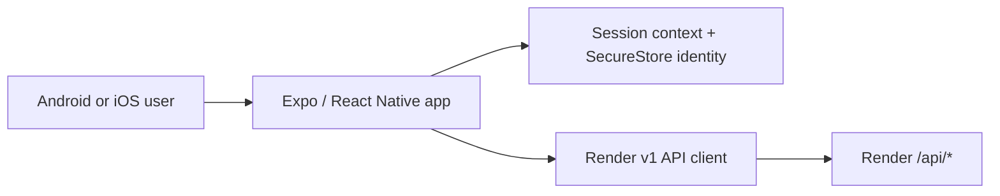
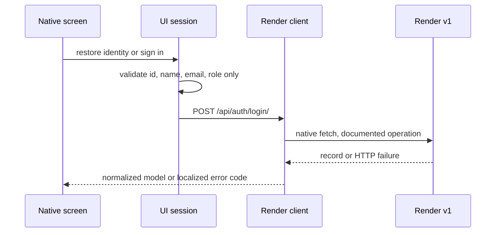

# Mobile Architecture Flows

## Rules

- UI screens call feature hooks; hooks call the single operation-level API client.
- Only normalized identity persists in SecureStore. It is a UI session, not a server authorization claim.
- The root and Portal guards wait for restoration and redirect unauthenticated
  users to Access. The password stays in the Access form only for the login
  request and is cleared immediately after success.
- Offline reads are marked stale. Every mutation is blocked before calling Render when connectivity is unavailable; no operation is queued.
- Admin/professor visibility is checked at navigation level now and at each
  mutation action when those screens are introduced; neither is authorization.
