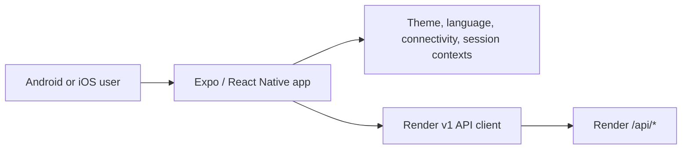
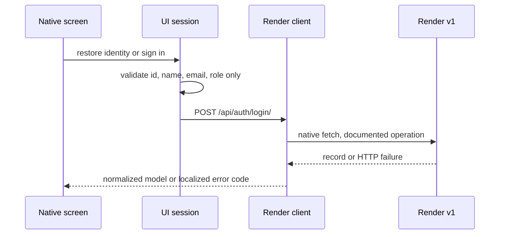

# Mobile Architecture Flows

## Rules

- UI screens call feature hooks; hooks call the single operation-level API client.
- Only normalized identity persists in SecureStore. It is a UI session, not a server authorization claim.
- The public root is Welcome. Its access action waits for restoration and sends
  a restored identity to Portal or an unauthenticated user to Access; the
  Portal guard still redirects unauthenticated deep links to Access. The
  password stays in the Access form only for the login request and is cleared
  immediately after success.
- Home calls `listReservations` through its feature hook, filters the returned
  records to the authorized UI scope and future dates, and limits the display
  to three. It uses an explicit offline state or stale banner instead of
  substituting local dashboard data.
- Availability validates date/time input locally, then calls only
  `getLabAvailability` with `fecha`, `hora_inicio`, and `hora_fin`. Its selected
  lab route state is limited to `labId`, date, start time, and end time for the
  subsequent reservation screen.
- The mobile shell provides bottom navigation, theme and language controls, and
  a native NetInfo-backed offline banner. It does not queue work; future mutation
  screens consume its connectivity context to disable actions before transport.
- Offline reads are marked stale. Every mutation is blocked before calling Render when connectivity is unavailable; no operation is queued.
- Admin/professor visibility is checked at navigation level now and at each
  mutation action when those screens are introduced; neither is authorization.
