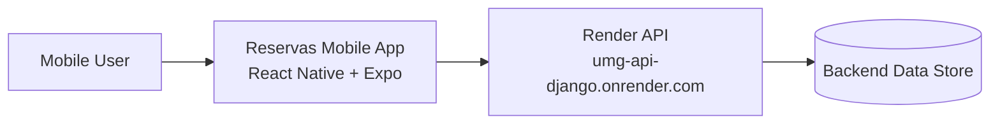
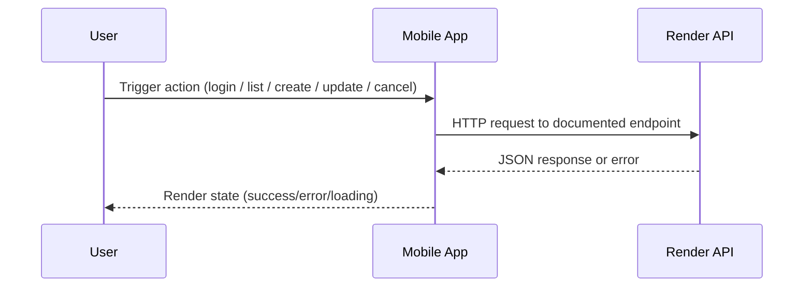
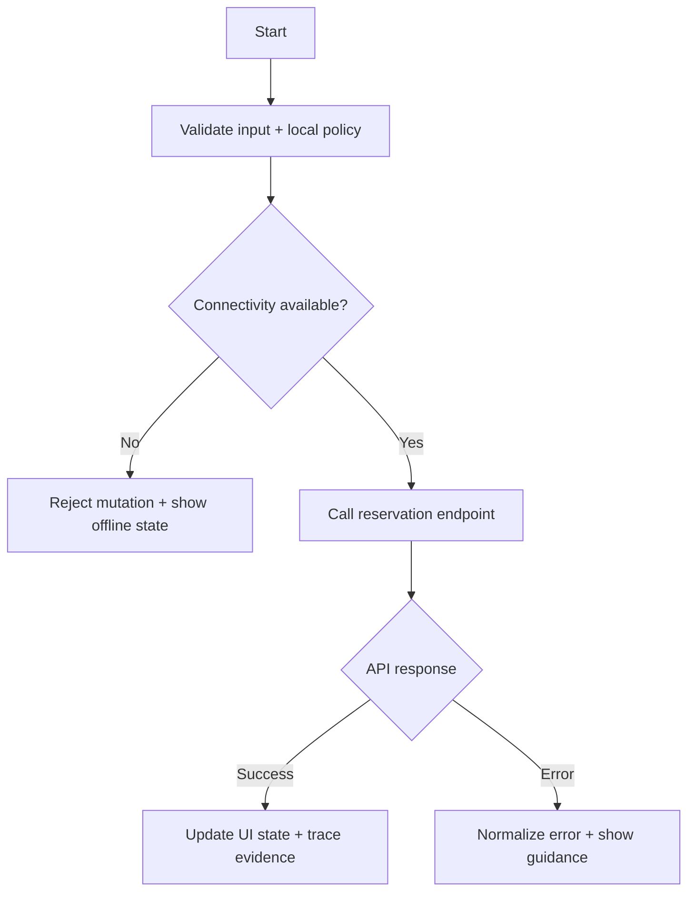
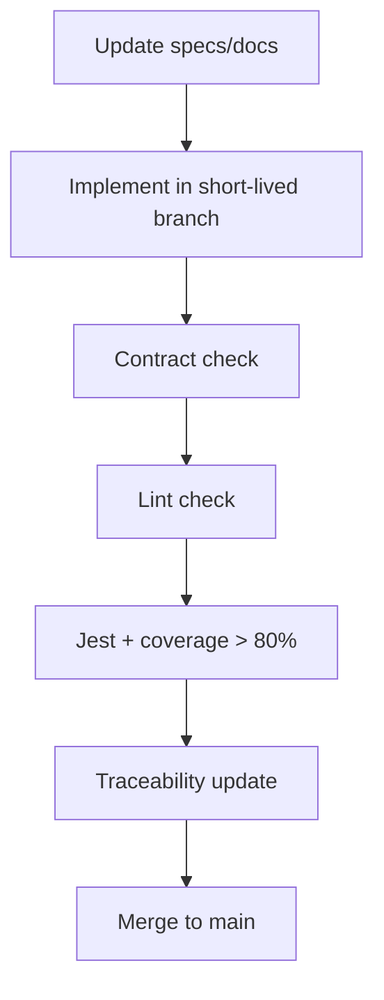

# Architecture Flows

This file explains high-level architecture and request/response flows for the mobile client.

## 1. System context

## 2. Client to API flow

## 3. Reservation operation flow

## 4. Delivery and governance flow

## 5. Notes

- The diagrams reflect current governance intent.
- Before coding, reconcile any baseline conflicts documented in `stack.md`.
